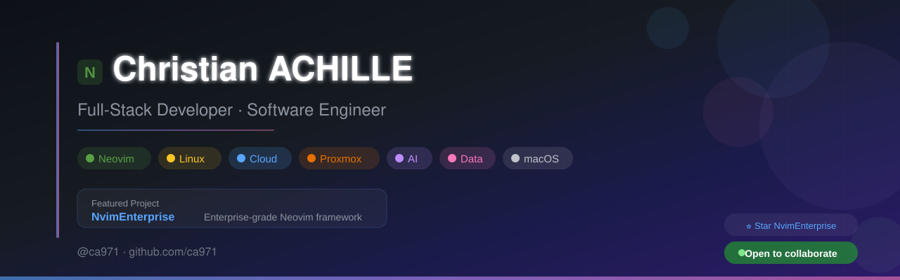

<div align="center">



</div>

<br/><br/>

<div align="center">

# Hey, I'm ca971 - Christian ACHILLE 👋

**Full-Stack Developer · Software Engineer · Open Source Craftsman**

I build tools that empower developers and engineering teams.

[](https://www.linkedin.com/in/christianachille/)
[](https://x.com/ChristianACHIL)
[](https://www.facebook.com/christianachille971/)
[](https://github.com/ca971)

</div>

---

## 🧑‍💻 About Me

```text
🇫🇷 Based in France
💼 Full-Stack Developer & Software Engineer
🖥️ Sysadmin — Linux servers, Proxmox virtualization, self-hosting
🔭 Creator of NvimEnterprise — enterprise-grade Neovim framework
🧩 Passionate about developer tooling, automation & clean architecture
🌱 Currently exploring AI-assisted development & data engineering
⚡ Fun fact: my Neovim config has OOP patterns, CI/CD, and release notes
```

---

## 🚀 Featured Project

<div align="center">

<a href="https://github.com/ca971/nvim-enterprise">
  
</a>

</div>

> **[NvimEnterprise](https://github.com/ca971/nvim-enterprise)** — A production-ready, multi-user
> Neovim framework with OOP architecture, 45+ language modules, 35+ plugins, AI integration,
> and full CI/CD pipeline.

| Highlights | |
|---|---|
| 🏗️ OOP class system with inheritance & mixins | 🤖 4 AI integrations (Copilot, Avante, Claude…) |
| 👥 Multi-user namespaces with hot-swap | 🌐 Cross-platform (macOS, Linux, Windows, WSL, BSD) |
| 🌍 45+ language modules (plug-and-play) | 🛡️ Security sandbox & path validation |
| 🔌 35+ lazy-loaded plugins | ⚡ Startup < 50ms |

```bash
# Try it now
curl -fsSL https://raw.githubusercontent.com/ca971/nvim-enterprise/main/install.sh | bash
```

---

## 🛠️ Tech Stack

<div align="center">

**Languages**


**Frontend**


**Backend & Data**


**Infrastructure & DevOps**


**Tools & Environment**


</div>

---

## 📊 GitHub Stats

<div align="center">


<br/>


</div>

---

## 🎯 What I'm Working On

| Project | Description | Status |
|---|---|---|
| [**NvimEnterprise**](https://github.com/ca971/nvim-enterprise) | Enterprise-grade Neovim framework | 🟢 Active |
| **Homelab** | Self-hosted infra on Proxmox (VMs, LXC, Docker) | 🟢 Active |
| **Data Dashboards** | PowerPivot & analytics solutions | 🔵 Ongoing |

---

## 💡 Philosophy

```text
"Automate everything. Document the rest. Share it all."
```

- 🧩 **Modularity** — Small, composable pieces over monoliths
- 🤖 **Automation** — If you do it twice, script it
- 📖 **Documentation** — Code without docs is a liability
- 🛡️ **Security by default** — Not as an afterthought
- 🤝 **Open Source** — Knowledge grows when shared

---

<div align="center">


If you like my work, consider giving a ⭐ to [NvimEnterprise](https://github.com/ca971/nvim-enterprise)

**Let's connect — I'm always open to collaboration.**

</div>
